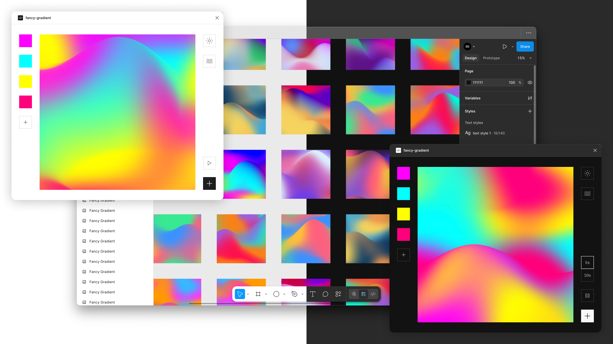

# Fancy Gradient

**Animated mesh gradient generator** for Figma — export smooth, colorful gradients as still images or looping videos.  

  

## Features

- **2 → unlimited colors** — build subtle blends or vibrant explosions  
- **Animated video export** — render **15s**, **30s**, or **60s** seamless loops  
- **Still image export** — save **1024×1024 PNGs**  
- **Regenerate button** — instantly shuffle into a fresh gradient  
- **Darken top button** — add depth and contrast to the mesh  
- **Theme support** — adapts to Figma’s light & dark UI themes  
- **Dynamic sizing** — auto-fits to your selection, or the viewport if none selected  

## Getting Started

1. Open Figma → go to **Plugins → Browse Plugins in Community**  
2. Search for **“fancy-gradient”**  
3. Click **Install**  
4. Run from the **Plugins** menu and start generating

## Exports

- **Still Image:** 1024×1024 PNG  
- **Video:** 1024×1024 WebM (15s, 30s, or 60s loop)  

## License

MIT